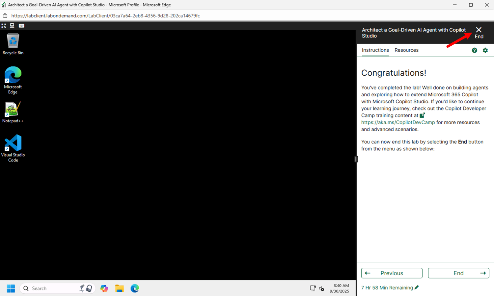

@lab.Title

Login to your VM with the following credentials...

**Username: +++@lab.VirtualMachine(Win11-Pro-Base).Username+++**

**Password: +++@lab.VirtualMachine(Win11-Pro-Base).Password+++** 

 

---

## Welcome to Your Learning Journey! 🎯

We're thrilled to have you join us for this exciting hands-on lab experience! Throughout this session, you'll embark on an engaging learning adventure where you'll master advanced concepts and practical skills that will transform how you work with AI agents.

In this comprehensive lab, you will learn:

- **How to work with topics of Copilot Studio in an advanced way** - Discover sophisticated techniques for designing, configuring, and managing conversational flows that create seamless and intelligent user experiences
- **How to leverage the AI Builder to dynamically handle user's input** - Master the art of using AI Builder's powerful capabilities to intelligently process, understand, and respond to diverse user inputs in real-time
- **How to use Generative Answers action to dynamically search knowledge bases and generate answers** - Unlock the potential of generative AI to automatically search through your knowledge repositories and craft contextual, accurate responses

Get ready to dive deep into the world of intelligent agents and discover how these cutting-edge technologies can revolutionize your solutions. Let's begin this exciting journey together!

===

!INSTRUCTIONS [Writing advanced topics with AI Builder](https://raw.githubusercontent.com/microsoft/ignite25-LAB564-architect-a-goal-driven-ai-agent-with-copilot-studio/refs/heads/main/lab/instructions/lab-topics-ai-builder.md?token=GHSAT0AAAAAADKELEAESJGKDHTG54O47ET42G5J3BQ)

Congratulations! You have successfully built an intelligent topic routing system that leverages AI Builder for sophisticated conversation management in Microsoft Copilot Studio. 

You can now move to Part 2 and have fun using the Generative Answers action in Copilot Studio.

===

!INSTRUCTIONS [Using Generative Answers in Microsoft Copilot Studio](https://raw.githubusercontent.com/microsoft/ignite25-LAB564-architect-a-goal-driven-ai-agent-with-copilot-studio/refs/heads/main/lab/instructions/lab-generative-answers.md?token=GHSAT0AAAAAADKELEAF6UOSMXRCDXY7X5IM2G5J3KQ)

Congratulations! You have completed the lab module and you learned how to integrate Generative Answers action in Microsoft Copilot Studio!

This approach demonstrates the flexibility of Microsoft Copilot Studio in creating specialized AI agents that can intelligently route conversations, access different knowledge sources, and provide customized responses based on your specific business needs.

The patterns you've learned today open doors to countless possibilities—what you've explored is just the beginning of what you can achieve with Microsoft 365 Copilot. Let your creativity and curiosity guide you as you imagine and build even more innovative solutions!

===

## Congratulations!

You've completed the lab! Well done on building agents and exploring how to extend Microsoft 365 Copilot with Microsoft Copilot Studio. If you'd like to continue your learning journey, check out the Copilot Developer Camp training content at [https://aka.ms/CopilotDevCamp](https://aka.ms/CopilotDevCamp) for more resources and advanced scenarios.

You can now end this lab by selecting the **End** button from the menu as shown below:

