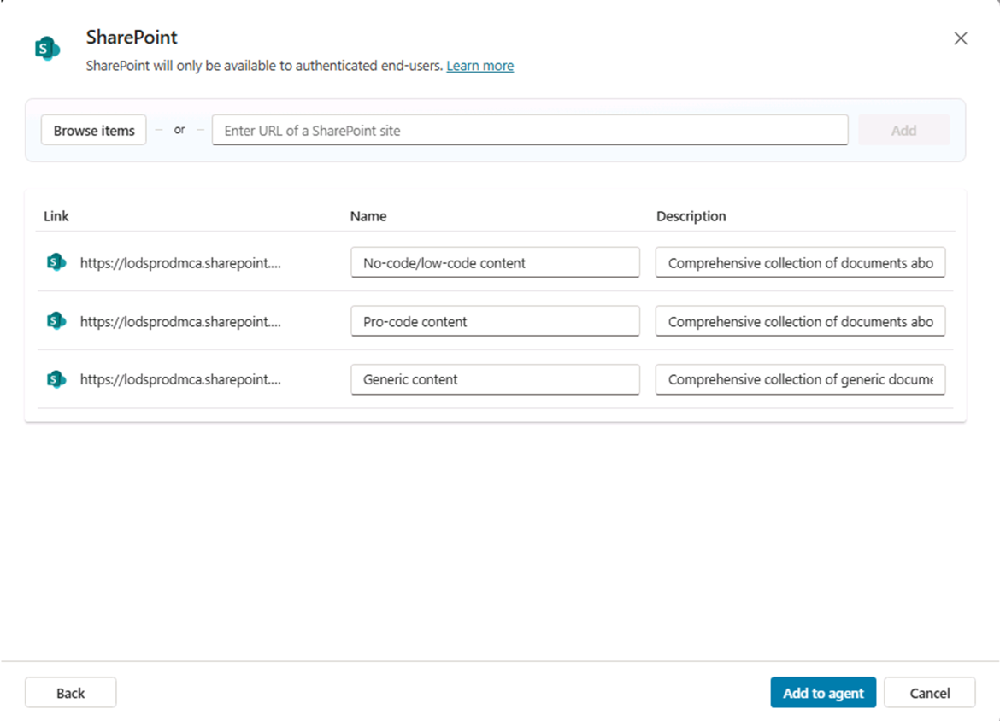

# Part 2 - Building Custom Topics with Generative Answers

In this lab module, you are going to understand how to create custom topics in Microsoft Copilot Studio that leverage the Generative Answers action to provide intelligent responses based on your organization's knowledge sources. You'll learn how to connect SharePoint document libraries as knowledge sources and create sophisticated topic flows that use PowerFx expressions to customize and format the responses from the Generative Answers action.

In this lab module you will learn:

- How to add SharePoint document libraries as knowledge sources in Copilot Studio
- How to create custom topics using the Generative Answers action
- How to use PowerFx expressions to parse and format responses from Generative Answers
- How to build conversational flows that provide targeted, knowledge-based responses

## Understanding Generative Answers in Topics

While the previous lab module focused on AI Builder and dynamic routing across multiple topics, this module explores how to create targeted conversational experiences using the **Generative Answers** action within custom topics. This approach allows you to:

- **Control when knowledge is searched**: Instead of relying on fallback generative answers, you decide exactly when to trigger knowledge-based responses
- **Specify targeted knowledge sources**: Each topic can use specific knowledge sources relevant to that conversation path
- **Customize the output**: Use PowerFx expressions to parse, format, and transform the generated responses
- **Create guided experiences**: Combine knowledge retrieval with structured conversation flows

The **Generative Answers** action in topics provides several advantages:

- **Precision**: Search specific knowledge sources for targeted scenarios
- **Flexibility**: Combine multiple knowledge sources within a single topic
- **Customization**: Use PowerFx to transform and format responses
- **Integration**: Seamlessly blend knowledge-based responses with traditional conversational logic

## Exercise 1: Setting Up SharePoint Document Library as Knowledge Source

In this exercise you are going to configure a SharePoint document library as a knowledge source for your Copilot Studio agent, providing a foundation for the **Generative Answers** actions in your custom topics.

### Step 1: Browse SharePoint Online Knowledge Site

In this step, you'll browse an already existing SharePoint site collection and set up three document libraries that will serve as knowledge sources for your Copilot Studio agent.

Navigate to SharePoint Online:

1. Open a browser and go to **+++https://lodsprodmca.sharepoint.com/sites/LAB564-Content+++** using your work account credentials:

   **Username: +++@lab.CloudPortalCredential(User1).Username+++**

   **Password: +++@lab.CloudPortalCredential(User1).Password+++**

1. Browse the **no-and-low-code** library to inspect its content
1. Copy the URL of the library in the format `https://lodsprodmca.sharepoint.com/sites/LAB564-Content/noandlowcode/`
1. Browse the **pro-code** library to inspect its content
1. Copy the URL of the library in the format `https://lodsprodmca.sharepoint.com/sites/LAB564-Content/procode/`
1. Browse the **generic** library to inspect its content
1. Copy the URL of the library in the format `https://lodsprodmca.sharepoint.com/sites/LAB564-Content/generic/`


The documents are created from the content of the Microsoft Learn site and will become the knowledge base of your agent through the Generative Answers action.

### Step 2: Adding SharePoint libraries as a Knowledge Sources

Navigate to +++https://copilotstudio.microsoft.com+++ and open the `Copilot Extensibility Advisor` agent that you created in previous module.

Navigate to the **Knowledge** section and add SharePoint as a knowledge source:

1. Select **+ Add knowledge**
1. In the **Featured** section, select **SharePoint**


1. Enter the SharePoint URL of the first document library `+++https://lodsprodmca.sharepoint.com/sites/LAB564-Content/noandlowcode/+++` and select **Add**


1. Configure the new knowledge base with the following settings:

    - **Name**: `+++No-code/low-code content+++`
    - **Description**: `+++Comprehensive collection of documents about creating agents with no-code/low-code techniques.+++`

1. Repeat the previous steps for the Pro-code content using the following settings:

    - **URL**: `+++https://lodsprodmca.sharepoint.com/sites/LAB564-Content/procode/+++`
    - **Name**: `+++Pro-code content+++`
    - **Description**: `+++Comprehensive collection of documents about creating agents with pro-code techniques.+++`

1. Repeat one last time the previous steps for the Generic content using the following settings:

    - **URL**: `+++https://lodsprodmca.sharepoint.com/sites/LAB564-Content/generic/+++`
    - **Name**: `+++Generic content+++`
    - **Description**: `+++Comprehensive collection of generic documents about Microsoft 365 Copilot extensibility.+++`



1. Select the **Add to agent** command to add the three knowledge sources to the agent

Wait for the status to change to **Ready** before proceeding to the next exercise.


Now your agent has specific knowledge bases about creating agents with both no-code/low-code and pro-code techniques, as well as some generic knownledge about extending Microsoft 365 Copilot.

## Exercise 2: Adding Generative Answers to Existing Topics

In this exercise you will enhance two existing topics that were created in Part 1 of this training by adding Generative Answers actions. These topics will use the targeted knowledge sources from your SharePoint document libraries to provide intelligent, knowledge-based responses.

### Step 1: Locating the Existing Topics

Navigate to the **Topics** section in your agent. You should see two topics that were created in Part 1:

1. **No-Code/Low-Code Agents** - A topic for handling questions about no-code/low-code development
2. **Pro-Code Agents** - A topic for handling questions about professional development approaches

If these topics don't exist, you'll need to create them first following the patterns described in Part 1 of this lab.


### Step 2: Adding Generative Answers to the No-Code/Low-Code Topic

Open the **No-Code/Low-Code Agents** topic for editing:

1. Select the **+** to insert a new action right after the **Send a message** action that you configured in the previous part of this lab
1. Select **Advanced** -> **Generative Answers**


1. Configure the 1️⃣ **Input** of the action with the 2️⃣ system variable 3️⃣ `Activity.Text`


Now you can fine tune the settings of the **Generative Answers** action. Select the **Edit** button and configure the following properties:

1. **Knowledge sources**:

    - Enable the flag **Search only selected sources** 
    - Select only the `No-code/Low-code content` SharePoint knowledge source you configured in Exercise 1

1. **Web search**:

    - Disable the flag **Web search**
    - Disable the flag **Allow the AI to use its own general knowledge (preview)**

1. **Content moderation**: 

    - Enable the flag **Customize**
    - Set to **Medium** for balanced content filtering

1. **Advanced**:

    - Expand the section
    - Keep the flag **Send a message** enabled
    - Set **Save LLM response** to **Complete (recommended)**
    - **Save bot response as**: Create a new variable called `+++noCodeResponse+++`


The Generative Answers action is now configured to use only the `No-code/Low-code content` source, to not rely on web or LLM general knowledge, and to store the complete LLM response into a topic variable with name `noCodeResponse`.

Select the **Save** command to save the updated definition of this topic.

### Step 3: Adding Generative Answers to the Pro-Code Topic

Now enhance the second topic. Open the **Pro-Code Agents** topic for editing and apply the same changes that you applied on the **No-Code/Low-Code Agents** topic. This second time, use the following settings:

- Select only the `Pro-code content` SharePoint knowledge source
- Save the response of the LLM into a topic variable with name `+++proCodeResponse+++`.

### Step 4: Testing Both Enhanced Topics

**Save** both topics and **Publish** your agent. Enable the 1️⃣ **Test** panel, toggle the 2️⃣ **Activity Map** to `On`, and enable the option to 3️⃣ **Track between topics**.


Then test both topics to ensure they work correctly using the following prompts:

**Test the No-Code/Low-Code Topic:**
```
+++How do I create an agent with Copilot Studio?+++
```

Expected flow:
- No-Code/Low-Code topic triggers
- Question about specific aspect appears
- Generative answers action processes the user's prompt
- Receive guidance from the no-code/low-code knowledge source

**Test the Pro-Code Topic:**
```
+++How do I build a custom agent with code?+++
```

Expected flow:
- Pro-Code topic triggers
- Question about technical aspect appears  
- Generative answers action processes the user's prompt
- Receive technical guidance from the pro-code knowledge source

This approach ensures that each topic has a focused scope and searches the most relevant knowledge source for the user's needs, providing more accurate and targeted responses.

## Exercise 3: Customizing Output with PowerFx and Adaptive Cards (bonus step)

If you like, and if time permits, in this bonus exercise you will enhance the **No-Code/Low-Code Agents** topic created in Exercise 2 by using PowerFx expressions to parse and format the responses from the Generative Answers actions. You'll create adaptive cards that display both the AI-generated response and the source references, providing users with comprehensive and visually appealing information.

### Step 1: Enhancing the No-Code/Low-Code Topic with Adaptive Cards

Open the **No-Code/Low-Code Agents** topic for editing:

1. Navigate to the **Topics** section and select the **No-Code Low-Code Agents** topic
1. Locate the **Generative Answers** node 
1. Edit its properties and in the **Advanced** section disable the option **Send a message**


We'll replace the default and simple message with a more sophisticated adaptive card presentation accordingly to the following steps:

1. Add a **Send a message** node after the Generative Answers node
1. Select **+ Add node** > **Send a message**
1. Instead of using a simple text message, select **+ Add** > **Adaptive Card**


In the property pane on the right side, select **Edit adaptive card** to open the integrated Adaptive Card designer.
Configure the adaptive card definition with the following JSON template that includes both response and additional references:

```json
+++
{
    "type": "AdaptiveCard",
    "version": "1.4",
    "body": [
        {
            "type": "Container",
            "style": "emphasis",
            "items": [
                {
                    "type": "TextBlock",
                    "text": "🚀 No-Code/Low-Code Agent Development Guidance",
                    "weight": "Bolder",
                    "size": "Large",
                    "color": "Accent"
                },
                {
                    "type": "TextBlock",
                    "text": "Topic: ${noCodeTopic}",
                    "weight": "Bolder",
                    "spacing": "Medium"
                }
            ]
        },
        {
            "type": "Container",
            "style": "default",
            "items": [
                {
                    "type": "TextBlock",
                    "text": "**📋 Guidance:**",
                    "weight": "Bolder",
                    "spacing": "Medium"
                },
                {
                    "type": "TextBlock",
                    "text": "${noCodeResponse}",
                    "wrap": true,
                    "spacing": "Small"
                }
            ]
        },
        {
            "type": "Container",
            "style": "accent",
            "items": [
                {
                    "type": "TextBlock",
                    "text": "📚 **Additional documentation:** [Copilot Dev Camp](https://aka.ms/CopilotDevCamp)",
                    "weight": "Bolder",
                    "size": "Small"
                },
                {
                    "type": "TextBlock",
                    "text": "💡 **Need more help?** Try asking follow-up questions or explore our comprehensive documentation.",
                    "wrap": true,
                    "size": "Small",
                    "spacing": "Small"
                }
            ]
        }
    ]
}
+++
```

Select **Save** in the upper right corner of the Adaptive Card designer and **Close** the designer.


Now in the **Adaptive Card properties** pane select **JSON card** and switch to **Formula**.


A new simplified editor shows up. Expand the editor selecting the expand arrows in the upper right corner and update the JSON content in order to replace the following text with the corresponding PowerFx formulas:

- **"Topic: ${noCodeTopic}"**: `+++Concatenate("Topic: ", System.Activity.Text)+++`
- **"${noCodeResponse}"**: `+++Topic.noCodeResponse.Text.MarkdownContent+++`


Close the JSON editor, **Save** the topic, and **Publish** the agent. 

### Step 2: Testing the Enhanced Adaptive Cards

It is now time to test the enhanced topic:

**Test the No-Code/Low-Code Topic with Adaptive Card:**
```
+++How do I create an agent with Copilot Studio?+++
```

Expected result:
- Topic triggers with existing question flow
- Generative Answers provides response from no-code knowledge source
- PowerFx formats the response with error handling and length limits
- Adaptive card displays with:
  - Structured header with emoji and topic
  - Formatted guidance content
  - Source reference section
  - Action buttons for follow-up and knowledge base access


Feel free to enhance als the **Pro-Code Agents** topic to use an Adaptive Card for rendering, if you like and if time permits.