# Part 1 - Advanced Topic Management with AI Builder Intelligence

In this lab module, you are going to understand how to create sophisticated conversation flows in Microsoft Copilot Studio using advanced topics and AI Builder for intelligent intent detection. You'll create a new "Copilot Extensibility Advisor" agent that implements dynamic topic routing based on user intent analysis. This lab demonstrates how to create intelligent agents that can automatically redirect conversations to appropriate specialized topics based on natural language understanding powered by AI Builder.

In this lab module you will learn:

- How to create and configure advanced topics in Microsoft Copilot Studio
- How to implement AI Builder models for intent classification
- How to use topic redirection for sophisticated conversation flows
- How to analyze user input with AI Builder to determine conversation paths
- How to create specialized topics for different user scenarios

### What is Topic Redirection?

Topic redirection in Microsoft Copilot Studio is a powerful feature that allows your agent to dynamically route conversations to specific topics based on user input or conditions. Think of it like a smart traffic controller for conversations:

Imagine you have a customer service agent that can help with different types of requests - billing questions, technical support, or product information. Instead of having one massive conversation flow that handles everything, topic redirection allows you to:

- **Analyze user intent:** Understand what the user is really asking for
- **Route intelligently:** Direct the conversation to the most appropriate specialized topic
- **Maintain context:** Keep track of the conversation flow and user information
- **Provide focused responses:** Each topic can be optimized for specific scenarios

### Benefits of AI Builder Integration

AI Builder brings advanced artificial intelligence capabilities directly into your Copilot Studio agents without requiring extensive coding knowledge. When integrated with topic management, AI Builder provides:

- **Natural Language Understanding:** Analyze user messages to extract intent and entities
- **Custom Classification:** Train models to recognize specific patterns in your domain
- **Structured Output:** Get consistent, JSON-formatted responses for reliable routing decisions
- **Continuous Learning:** Models improve over time with more data and feedback

For example, if a user says "I need help building an agent," AI Builder can analyze this request and determine whether they're interested in:
- No-code/low-code solutions using Copilot Studio's visual interface
- Pro-code development using VS Code and the Microsoft 365 Agents Toolkit

This intelligent analysis enables your agent to provide the most relevant help immediately.

## Exercise 1: Understanding Topic Architecture

In this exercise, you will learn about the topic structure and how to design an intelligent routing system for different user scenarios.

### What are Topics in Microsoft Copilot Studio?

Topics in Microsoft Copilot Studio are modular conversation components that handle specific scenarios or user intents. They consist of:

- **Trigger phrases:** Natural language expressions that activate the topic
- **Conversation flow:** A series of nodes that define the interaction logic
- **Variables:** Data storage for maintaining context throughout the conversation
- **Actions:** Operations like calling APIs, redirecting to other topics, or performing calculations

### Designing the Topic Architecture

For this lab, you'll create a system that helps users get appropriate guidance based on their development preferences:

1. **Main Routing Topic (`Intent Analysis`):** Analyzes user input and determines development approach preference
2. **No-Code/Low-Code Agents:** Provides guidance for agents designed with Microsoft Copilot Studio
3. **Pro-Code Agents:** Offers information about programmatic agent development with Visual Studio Code and the Microsoft 365 Agents Toolkit

The main topic will use AI Builder to analyze user messages and make intelligent routing decisions.

### Step 1: Planning the AI Builder Model

Before creating topics, let's understand what our AI Builder model needs to accomplish:

**Input:** User's natural language message (from Activity.Text)
**Processing:** Analyze the message to determine development approach preference
**Output:** JSON object with classification result

The AI Builder prompt will need to:
- Understand various ways users might express interest in different development approaches
- Handle ambiguous requests by asking clarifying questions
- Return structured JSON for reliable topic routing

Example inputs and expected outputs:
- "I want to build an agent without coding" → `{"approach": "no-code/low-code"}`
- "How do I develop agents programmatically?" → `{"approach": "pro-code"}`
- "I'm a developer looking for agent SDKs" → `{"approach": "pro-code"}`
- "Can I create agents with drag and drop?" → `{"approach": "no-code/low-code"}`

## Exercise 2: Creating a New Agent in Copilot Studio

In this exercise, you will create a new agent in Microsoft Copilot Studio that will serve as the foundation for your intelligent topic routing system.

### Step 1: Accessing Microsoft Copilot Studio

Navigate to +++https://copilotstudio.microsoft.com+++ and login with your Microsoft 365 work or school account.

**Username: +++@lab.CloudPortalCredential(User1).Username+++**

**Password: +++@lab.CloudPortalCredential(User1).Password+++**

If this is the very first time you run Copilot Studio and if you don't have a license, you will see the following screen through which you will be able to start a trial period.


### Step 2: Creating the new agent

Once you activated the Copilot Studio license, select **Create** in the left navigation menu of Copilot Studio, then choose **Agent** to create a new agent, or simply start with the agent creation wizard that you will see for the first time.

Choose to **Configure** and define your new agent with the following settings:

- **Name**: 

```
Copilot Extensibility Advisor
```

- **Description**: 

```
An intelligent advisor that helps users choose the best approach for extending Microsoft Copilot based on their needs and technical background
```

- **Instructions**: 

```
You are an expert advisor specializing in Microsoft Copilot extensibility options. You help users understand and choose between different approaches for extending Microsoft Copilot based on their technical background, project requirements, and preferences.

You can guide users through:
- No-code/low-code solutions using Microsoft Copilot Studio's visual interface
- Pro-code development using Visual Studio Code and the Agents Toolkit
- Understanding the benefits and limitations of each approach
- Getting started with their chosen development path

Always provide clear, helpful guidance and ask clarifying questions when needed to ensure users get the most appropriate recommendations for their specific use case.
```

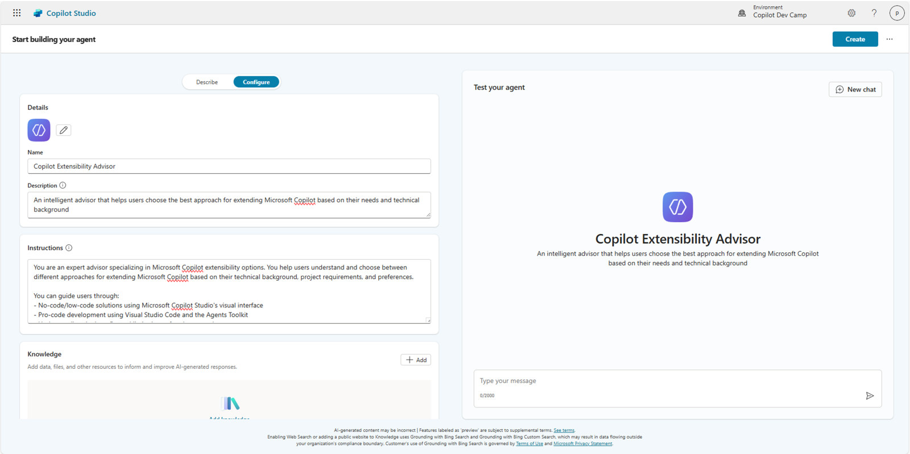

Select **Create** to create your new agent.

### Step 3: Configuring the agent's conversation starters

After creating the agent, you'll be taken to the agent configuration page. Wait for the **Publish** command in the upper right corner to become enabled. Then, scroll down and in the **Suggested prompts** section, add these helpful prompts:

1. Title: `Get development guidance` - Prompt: `I want to build an agent, what are my options?`
2. Title: `No-code approach` - Prompt: `I want to create agents without programming`
3. Title: `Developer approach` - Prompt: `I'm a developer looking for programmatic agent development`
4. Title: `Compare approaches` - Prompt: `What's the difference between no-code and pro-code agent development?`

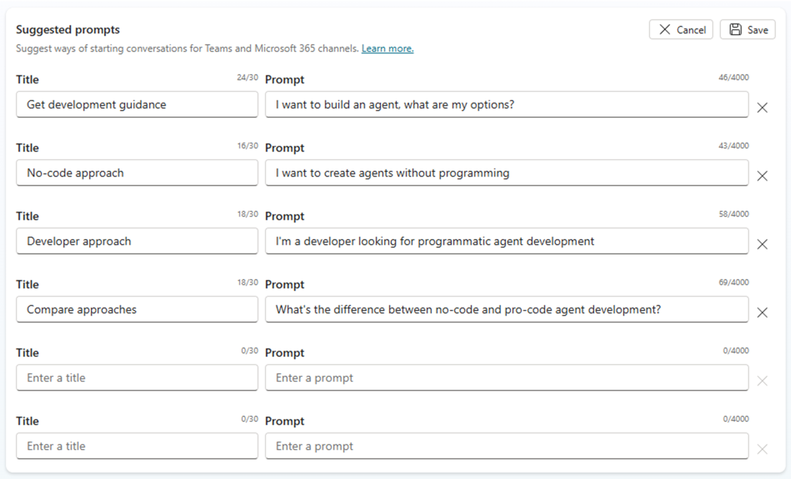

Select the **Save** button to confirm your changes.

### Step 4: Configuring agent settings

Ensure that the following settings are configured for optimal performance:

1. In the agent's **Details** panel, verify that the **Use generative AI to determine how best to respond to users and events** option is enabled
1. Confirm that the **GPT-4o** model is selected for the best natural language understanding capabilities
1. **Save** any changes made to the configuration

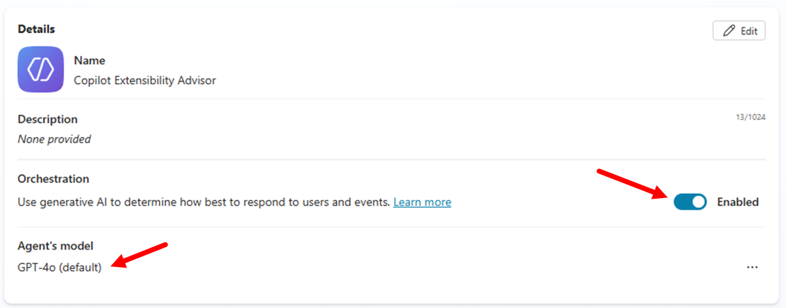

Now select the **Settings** command in the upper right corner of the screen and under the **Generative AI** section of settings, in the **Knowledge** group of settings, disable the following options:

- **Use general knowledge**
- **Use information from the Web**

Select **Save** to update the settings and then close the settings panel selecting the **X** icon in the upper right corner.

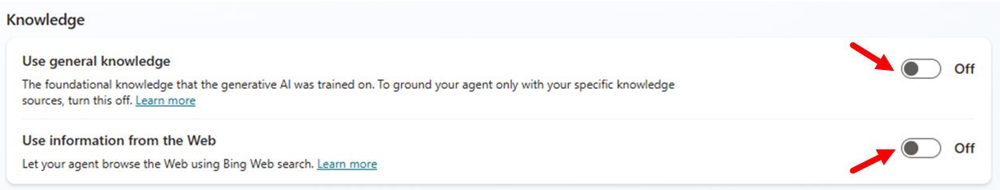


Your "Copilot Extensibility Advisor" agent is now ready to be enhanced with intelligent topic routing capabilities.

## Exercise 3: Creating the AI Builder Model

In this exercise, you will create and configure an AI Builder model that analyzes user intent to determine their preferred development approach.

### Step 1: Creating the Intent Analysis Topic

First, create the main topic that will use AI Builder for intelligent routing:

1. In your "Copilot Extensibility Advisor" agent, select the **Topics** tab
2. Select **+ Add a topic** and choose **From blank**
3. Rename it as 1️⃣ `Intent Analysis`
4. Fill the field 2️⃣ **Describe what the topic does** with the following text:

```
Analyses user messages to determine development approach preference and routes to appropriate topics. Trigger phrases can be: "I want to build an agent", "How do I create agents", "I need help with agent development", "Can you help me develop a chatbot", "I'm looking for agent building tools", "What are my options for creating agents".
```

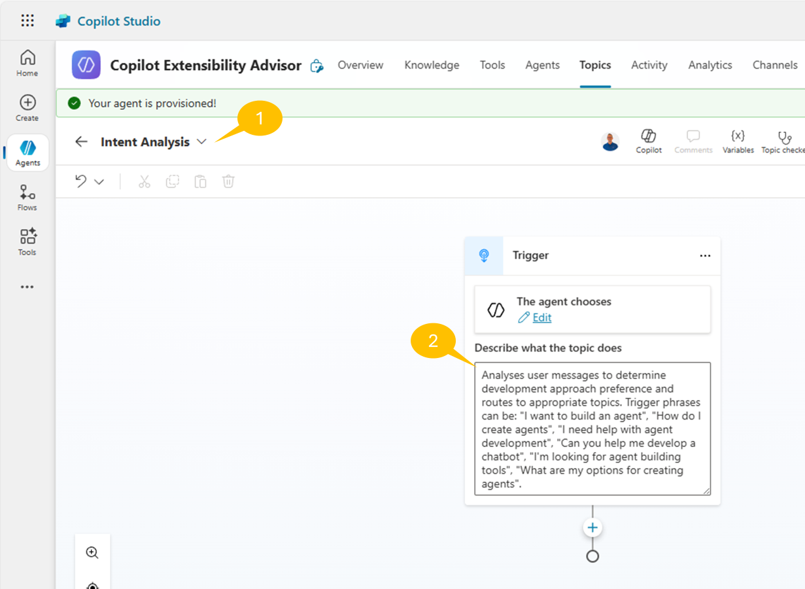

### Step 2: Using AI Prompt Builder

Now add the **New Prompt** action to the topic in order to leverage the **AI Builder** capabilities.

1. Select the 1️⃣ **+** command to add a new action to the topic
1. Select 2️⃣ **Add a tool** to open the list of tools
1. In the list of **Basic tools** select 3️⃣ **New prompt**

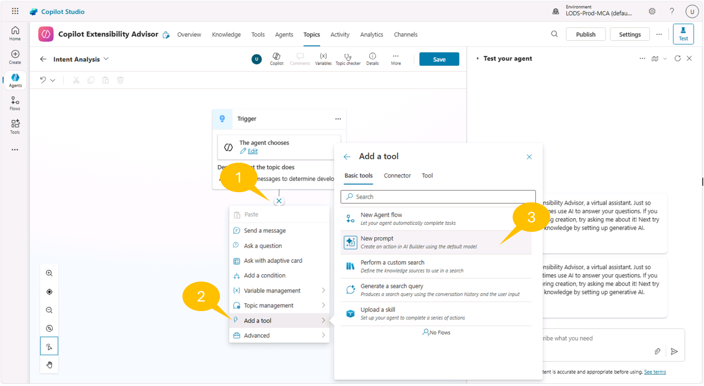

A new dialog window shows up allowing you to build a new prompt. Click the 1️⃣ top area of the dialog to give a name to the new prompt. For example name it `User's intent analysis`.

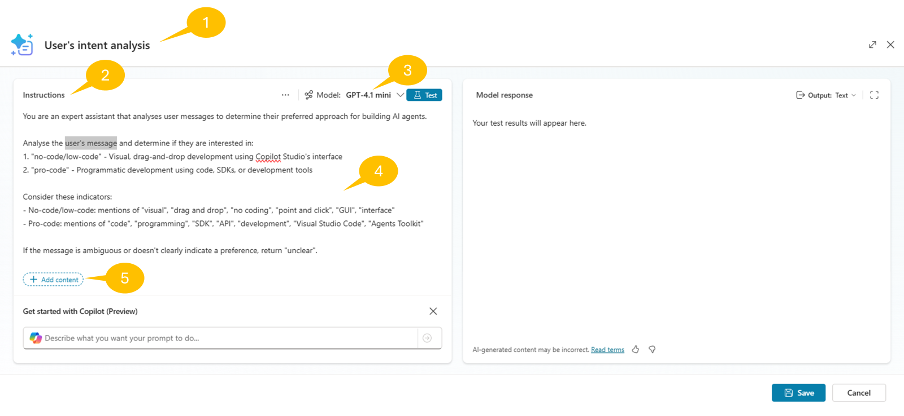

In the 2️⃣ **Instructions** section you can select the 3️⃣foundational model that you want to use. Available options are: 

- GPT-4.1-mini
- GPT-4.1
- GPT-5 chat
- o3
- GPT-5 reasoning

Let's use the default GPT-4.1-mini, which is enough for the prompt you are going to create.

In the 4️⃣ textarea just below the model selection, you can write the instructions for your new prompt. For example, use the following text:

```
You are an expert assistant that analyses user messages to determine their preferred approach for building AI agents. 

Analyze the user's message and determine if they are interested in:
1. "no-code/low-code" - Visual, drag-and-drop development using Copilot Studio's interface
2. "pro-code" - Programmatic development using code, SDKs, or development tools

Consider these indicators:
- No-code/low-code: mentions of "visual", "drag and drop", "no coding", "point and click", "GUI", "interface"
- Pro-code: mentions of "code", "programming", "SDK", "API", "development", "Visual Studio Code", "Agents Toolkit"

If the message is ambiguous or doesn't clearly indicate a preference, return "unclear".

Always respond with valid JSON in this exact format:
{"approach": "no-code/low-code"} 
or
{"approach": "pro-code"}
or
{"approach": "unclear"}

Do not include any additional text or explanation outside the JSON response.
```

Select the words `user's message` at the top of the instrucctions and select 5️⃣ **+ Add content** just below the instructions text.

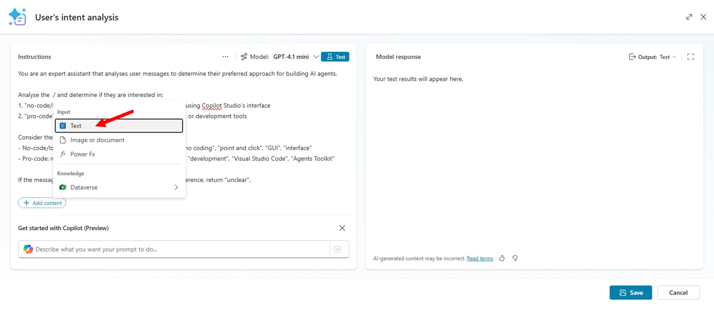

Select the option **Text** in popup dialog in order to insert a new text input field, which will be used to feed the AI Builder instructions with dynamic data provided by the topic. When configuring the input filed, you can also provide a **Sample data** value to use for testing purposes.

As you can see from the user interface, you can have different type of input fields like:

- **Text**: to add a text based input
- **Image or document**: to add an image or a document to process
- **PowerFx**: to add a PowerFx formula
- **Dataverse**: to use a Dataverse table of records

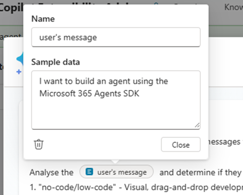

In the upper right corner of the AI Builder dialog, you can also configure the output as JSON to see the text properly formatted and to instruct Copilot Studio that the output will be a structured JSON.

Now, select **Test** to validate the output of the prompt using the sample data that you just configured for the input field. When you are happy with the output, select the **Save** command in the lower right side of the dialog to save the generated prompt and to go back to the topic designer. 

Notice that, accordingly to the prompt instructions, when you test the prompt the **Model response** will be a JSON message. 

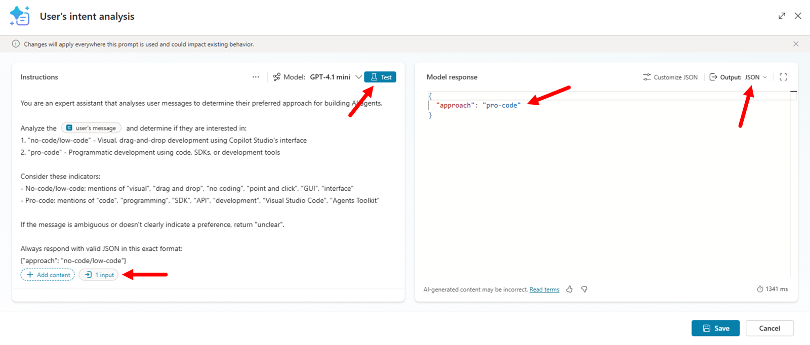

Select the **Inputs** variable of the Prompt Builder action and select the 1️⃣ **...** three dots to bind a variable, then select the 2️⃣ group of **System** variables, and then select 3️⃣ **Activity.Text**, which represents the input prompt provided by the user.

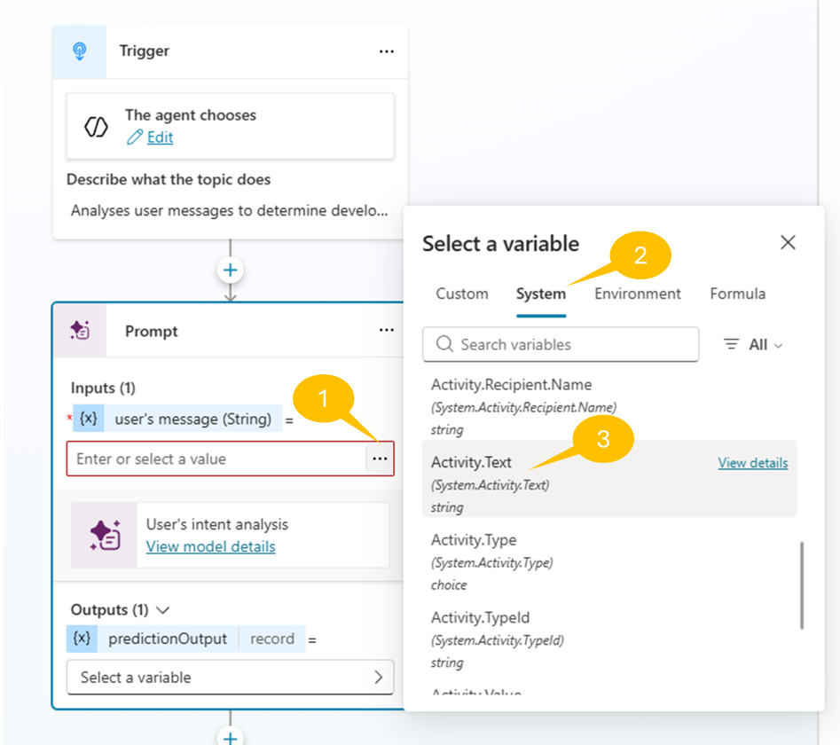

Then, configure a new variable to hold the output of the Prompt Builder action. For example, you can name it `intentPrediction`.

### Step 3: Prepare the child topics

Go back to the list of **Topics** and create a new topic from blank. Name it 1️⃣ **No-Code/Low-Code Agents**, select the 2️⃣ icon with two arrows to configure the trigger condition, and configure the trigger as 3️⃣ **It's redirected to**.

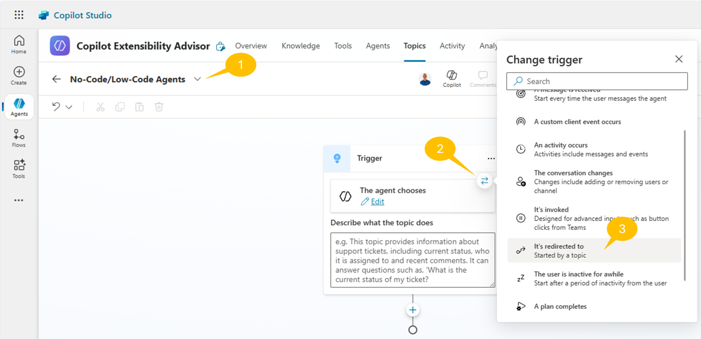

The above setting will configure the topic so that users can only reach it through another topic that redirects to it and not directly because of a specific user's prompt.

Now add an action of type **Send a message** and configure the message with value: `Cool! You want to create a no-code/low-code agent!`.

In the following screenshot you can see how the **No-Code/Low-Code Agents** topic looks like.

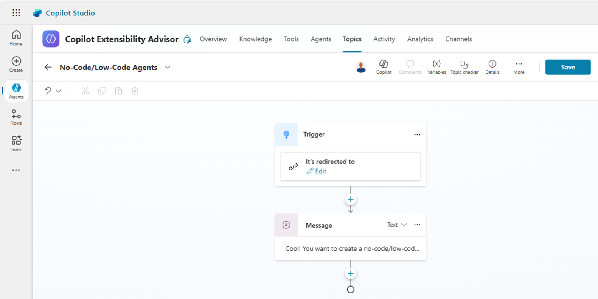

Now, follow the same steps and create yet another topic from blank with name **Pro-Code Agents**. Configure its trigger condition as like as the previous topic. In the **Send a message** action send the following message: `Perfect! You want to create a pro-code agent!`

In the Part 2 of this lab you will come back to this topics and you will improve them with the **Generative Answers** action.

### Step 4: Building the Conversation Flow

Now, go back to the **Intent Analysis** topic and create the conversation flow.

At the end of the topic, right after the **Prompt Builder**, Insert a new action of type **Set a variable value**, under the group **Variable management**.

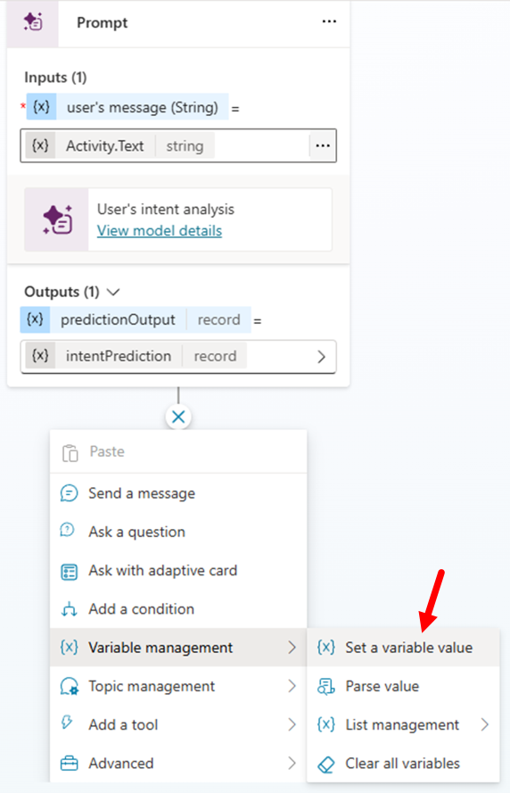

Select the 1️⃣ **Set variable** field, then select to 2️⃣ **Create a new variable**, and name it 3️⃣ `approach`.

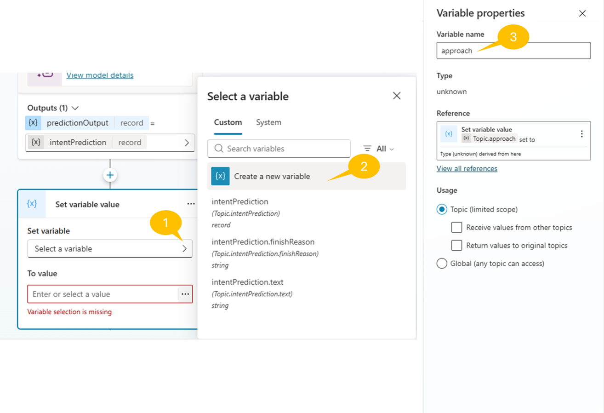

Now, select the **To value** field of the action and set its value to the following PowerFx formula:

```
Topic.intentPrediction.structuredOutput.approach
```

The above syntax instructs Copilot Studio to assign to the variable the actual value of the approach property in the JSON response that comes back from the Prompt Builder action.

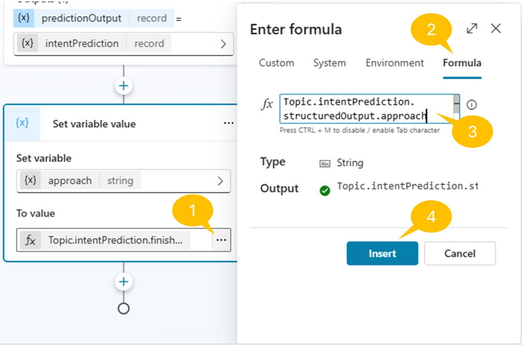

It is now time to evaluate the variable to determine where to redirect the user. Add a new action of type **Add a condition** to the topic and configure three branches accordingly to the following settings:

1. No-code/low-code branch

    - Name the first branch on the left with name 1️⃣ `+++No-code/low-code+++`
    - Click on 2️⃣ **Select a variable** and select the `approach` variable
    - Set the condition to 3️⃣ **is equal to** and set the value to compare to 4️⃣ `+++no-code/low-code+++`
    - Select the 5️⃣**+** button to add a new action inside the branch. Select the group of actions with name **Topic management**, then **Go to another topic**, and then select the topic with name `No-Code/Low-Code Agents` 

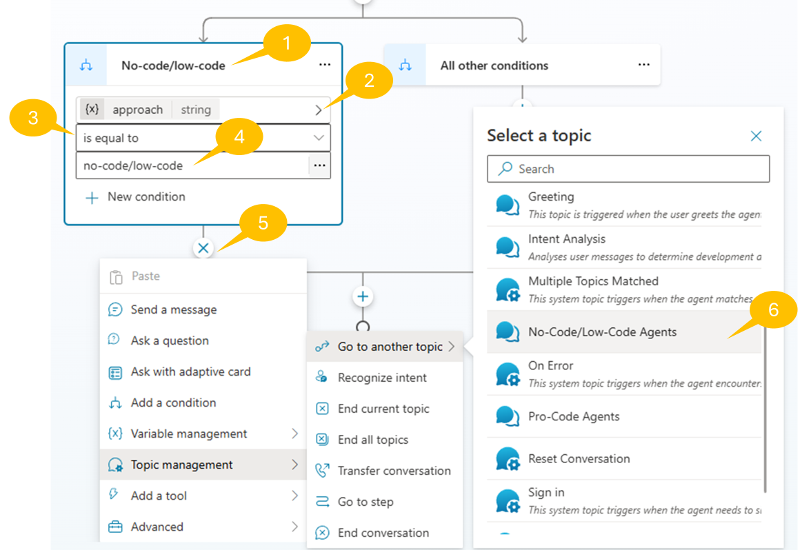

1. Pro-code branch

    - Select the **+** icon just before the conditional block and select **Add a condition** to add a new branch
    - Name the new branch with name `+++Pro-code+++`
    - Click on  **Select a variable** and select the `approach` variable
    - Set the condition to **is equal to** and set the value to compare to `+++pro-code+++`
    - Select the **+** button to add a new action inside the branch. Select the group of actions with name **Topic management**, then **Go to another topic**, and then select the topic with name `Pro-Code Agents`

1. All other conditions

    - Select the **+** icon and add a new action inside the branch on the right side with name **All other conditions**
    - Add an action of type **Send a message** and simply write the following message: `+++I'm sorry! Your input is unclear!+++`

1. Right after the conditional branch, add an action of type **End current topic**, which is available in the group of **Topic management** actions.

Select **Save** to save the updates definition of the `Intent Analysis` topic.

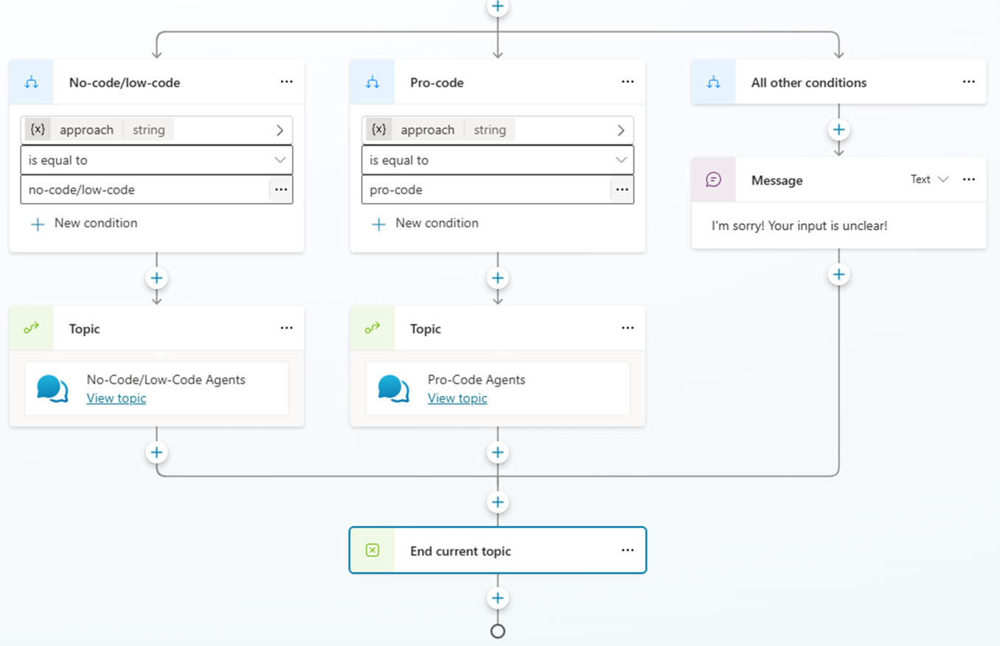

## Exercise 4: Testing the conversational flow

In this exercise, you will test your intelligent topic routing system to ensure it correctly analyzes user intent and routes conversations to the appropriate specialized topics.

### Step 1: Publishing and Testing the Agent

Before testing, ensure your agent is published and ready for interaction:

1. Select **Publish** in the upper right corner of Copilot Studio
2. Wait for the publishing process to complete
3. Once published, select **Test** to open the test panel on the right side of the screen

### Step 2: Testing No-Code/Low-Code Routing

Test the routing to the "No-Code/Low-Code Agents" topic with these sample prompts:

**Test Case 1: Clear No-Code Intent**

```
+++I want to create an agent but I'm not a developer+++
```

**Expected Result:** The agent should analyze the message, determine it's a no-code/low-code request, and route to the "No-Code/Low-Code Agents" topic, displaying the message "Cool! You want to create a no-code/low-code agent!"

**Test Case 2: Developer-focused Request**
```
+++Is there any SDK for building conversational agents?+++
```

**Expected Result:** The agent should identify this as a pro-code request and route to the "Pro-Code Agents" topic, displaying "Perfect! You want to create a pro-code agent!"

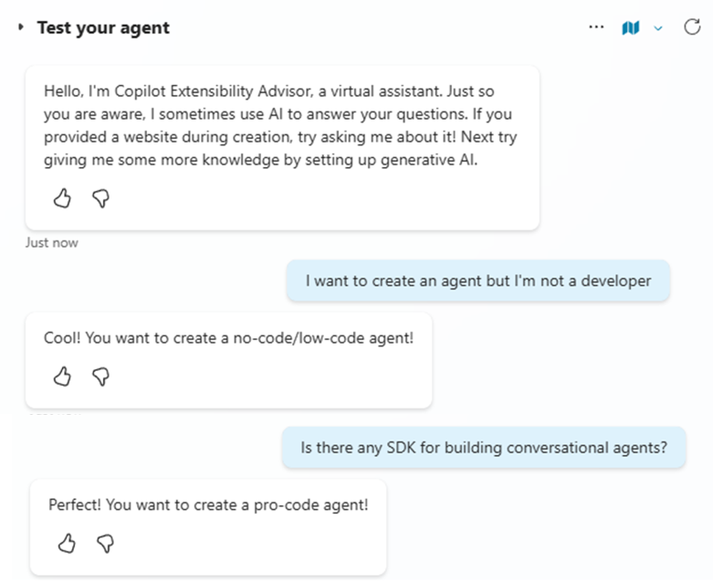
